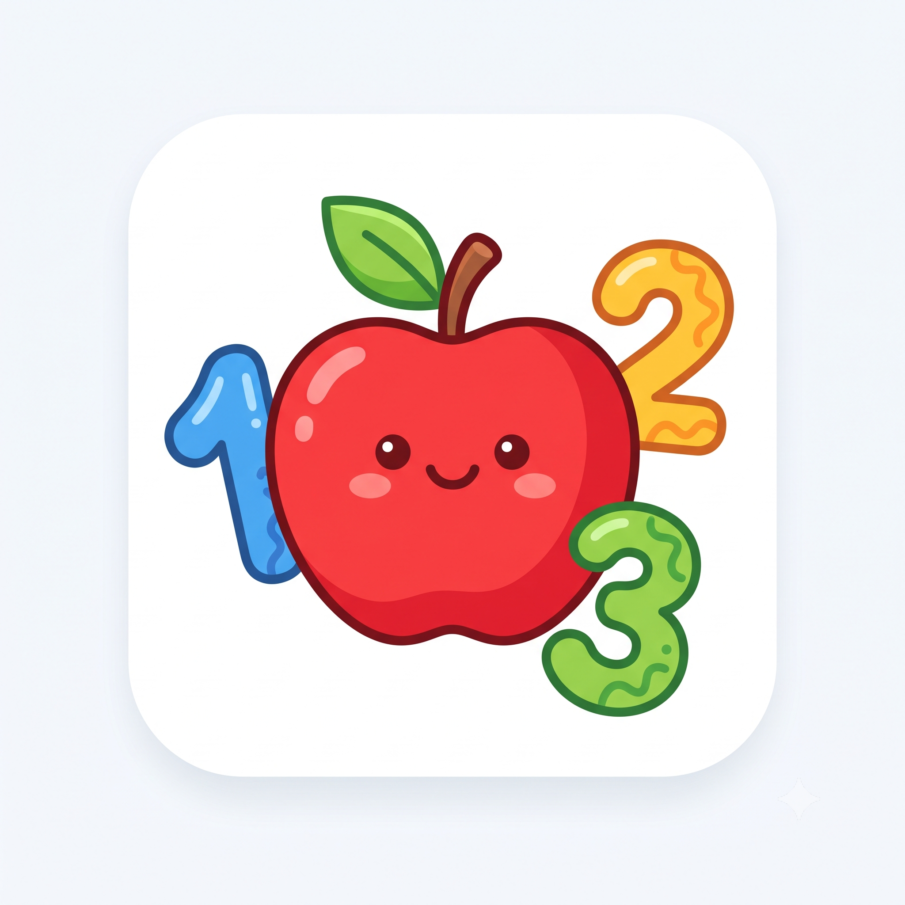
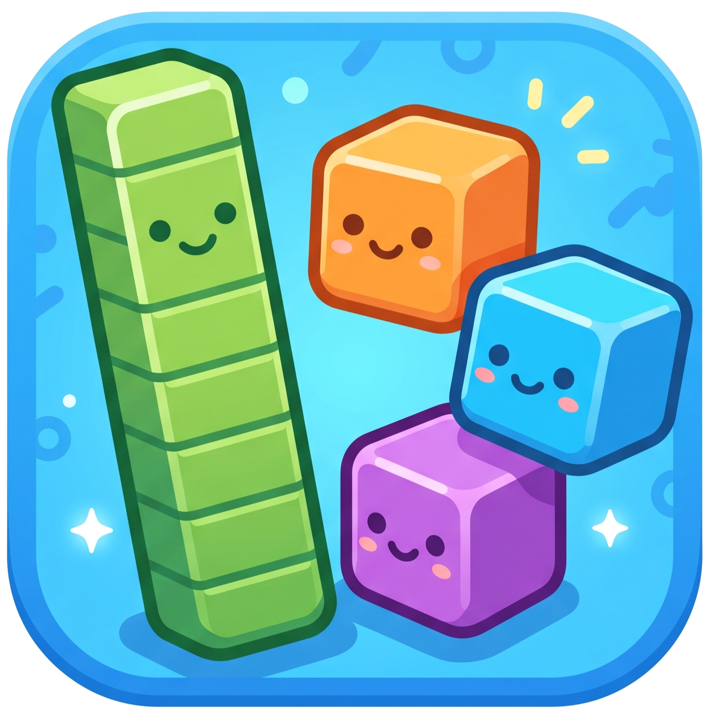
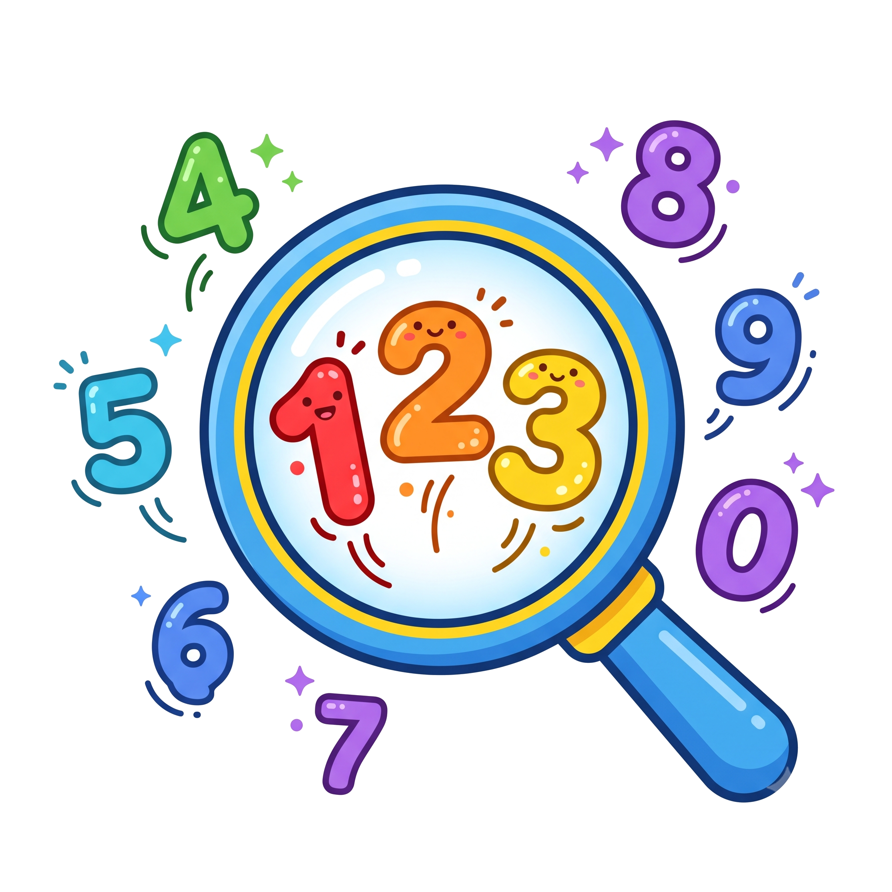
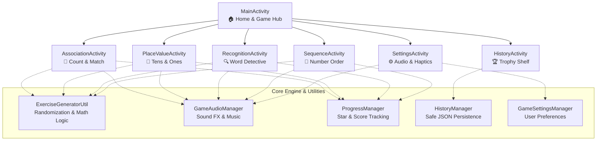

<div align="center">

  

  # 🌟 Number Quest

  ### *Play, Learn, and Become a Number Hero!*

  [-brightgreen?style=for-the-badge&logo=android)](https://developer.android.com)
  [](https://developer.android.com)
  [](https://www.oracle.com/java/)
  [](https://gradle.org)
  [](https://m3.material.io)
  [](#child-friendly-ux--safety)

  <p align="center">
    <a href="#-about-the-project">About</a> •
    <a href="#-the-4-learning-quests">4 Quests</a> •
    <a href="#-game-modes">Game Modes</a> •
    <a href="#-interactive-playground">Interactive Quiz</a> •
    <a href="#-app-architecture">Architecture</a> •
    <a href="#-installation--build">Get Started</a>
  </p>

</div>

---

## 📖 About the Project

**Number Quest** is an interactive, gamified Android educational application developed for early learners (ages 4–8) to master foundational mathematics concepts from **0 to 99**. 

Designed specifically without intimidating mathematical symbols like `+`, `-`, or `=`, Number Quest leverages intuitive visual aids, lively animations, encouraging soundscapes, and multi-sensory interactions (drag-and-drop & tap) so every child can discover the joy of numbers at their own pace!

### 🎓 Academic Information
- **Institution:** Universiti Tunku Abdul Rahman (UTAR)
- **Course:** UCCD3223 Mobile Applications Development
- **Assignment:** Individual Practical Assignment
- **Student Name:** Chai Boon Hong
- **Student ID:** 2206806
- **Practical Group:** P1
- **Package ID:** `com.uccd3223.p1_chai_boon_hong_2206806`

---

## 🗺️ The 4 Learning Quests

<table>
  <tr>
    <td width="25%" align="center">
      <br/>
      <b>1. Count & Match</b><br/>
      <i>Number-to-Object Association</i>
    </td>
    <td width="25%" align="center">
      <br/>
      <b>2. Tens & Ones</b><br/>
      <i>Visual Place Value</i>
    </td>
    <td width="25%" align="center">
      <br/>
      <b>3. Word Detective</b><br/>
      <i>Number & Word Recognition</i>
    </td>
    <td width="25%" align="center">
      <br/>
      <b>4. Number Order</b><br/>
      <i>Sequencing & Sorting</i>
    </td>
  </tr>
  <tr>
    <td valign="top">
      Count random single-digit groups of colorful <b>apples</b>, <b>stars</b>, or <b>balloons</b> (1–9) and choose the matching digit. Reinforces 1-to-1 correspondence.
    </td>
    <td valign="top">
      Visually explore two-digit quantities (0–99) using <b>Ten-Blocks</b> (rods of 10) and <b>One-Blocks</b> (individual units) to demystify base-10 decomposition.
    </td>
    <td valign="top">
      Become a reading detective! Associate numerals (0–99) with their written English words (e.g., <code>"forty-two" ↔ 42</code>) in both directions.
    </td>
    <td valign="top">
      Order numbers in <b>ascending</b> (smallest to biggest) or <b>descending</b> (biggest to smallest) sequence using intuitive drag-and-drop or tap placement.
    </td>
  </tr>
</table>

---

## 🎮 Game Modes

Whether in a classroom or during weekend playtime, Number Quest offers three game modes tailored to different learning tempos:

```
                  ┌────────────────────────────────────────┐
                  │          CHOOSE YOUR ADVENTURE         │
                  └───────────────────┬────────────────────┘
                                      │
         ┌────────────────────────────┼────────────────────────────┐
         ▼                            ▼                            ▼
┌─────────────────┐          ┌─────────────────┐          ┌─────────────────┐
│   🎈 FUN MODE   │          │ ⏱️ TIME ATTACK  │          │  ⚡ ROUND RUSH   │
├─────────────────┤          ├─────────────────┤          ├─────────────────┤
│ • Untimed play  │          │ • 60s / 90s /   │          │ • Fixed time    │
│ • Zero pressure │          │   120s options  │          │   per round     │
│ • Gentle retry  │          │ • Star frenzy   │          │ • Accelerating  │
│ • Star collector│          │ • High scores   │          │ • Skill climber │
└─────────────────┘          └─────────────────┘          └─────────────────┘
```

| Mode | Timer | Ideal For | Scoring & Goal |
| :--- | :--- | :--- | :--- |
| **🎈 Fun Mode** | No timer | First-time learners, relaxed exploration | Earn stars for every correct answer, unlimited retries |
| **⏱️ Time Attack** | 60s, 90s, or 120s | Rapid recall & excitement | Score as many stars as possible before the clock expires |
| **⚡ Round Rush** | Per-round countdown | Challenge-seekers & advanced players | Clear each round within the allotted time to advance |

---

## 🧩 Interactive Mini-Quiz (Try It Out!)

Curious how the game teaches children? Click below to test your skills just like our young learners:

<details>
<summary><b>🍎 Quest 1: Count & Match Sample</b></summary>
<br/>

> **Prompt:** *"How many balloons can you count?"*
> 
> 🎈 &nbsp; 🎈 &nbsp; 🎈 &nbsp; 🎈 &nbsp; 🎈
> 
> *Which number matches?* &nbsp; `[ 3 ]` &nbsp; `[ 5 ]` &nbsp; `[ 7 ]` &nbsp; `[ 9 ]`

<details>
<summary><b>👉 Click to reveal answer</b></summary>

> **Answer:** **5** 🎉
> *"Great counting! You found 5 balloons."* ⭐
</details>
<br/>
</details>

<details>
<summary><b>🧱 Quest 2: Tens & Ones Sample</b></summary>
<br/>

> **Prompt:** *"What number do the blocks make?"*
>
> 🟦 🟦 🟦 *(3 Tens Blocks)* &nbsp; + &nbsp; 🟨 🟨 🟨 🟨 *(4 Ones Blocks)*
>
> *What number is this?* &nbsp; `[ 34 ]` &nbsp; `[ 43 ]` &nbsp; `[ 7 ]` &nbsp; `[ 30 ]`

<details>
<summary><b>👉 Click to reveal answer</b></summary>

> **Answer:** **34** 🎉
> *"3 tens and 4 ones make 34."* ⭐
</details>
<br/>
</details>

<details>
<summary><b>🔍 Quest 3: Word Detective Sample</b></summary>
<br/>

> **Prompt:** *"Which words match this number?"*
>
> # **78**
>
> Choices:
> - A) eighty-seven
> - B) seventy-eight
> - C) seventeen
> - D) eighty

<details>
<summary><b>👉 Click to reveal answer</b></summary>

> **Answer:** **B) seventy-eight** 🔍
> *"Great matching! 78 matches seventy-eight."* ⭐
</details>
<br/>
</details>

<details>
<summary><b>🔢 Quest 4: Number Order Sample</b></summary>
<br/>

> **Prompt:** *"Put the numbers in order: Smallest to biggest"*
>
> Available cards: `[ 42 ]` &nbsp; `[ 7 ]` &nbsp; `[ 89 ]` &nbsp; `[ 19 ]`

<details>
<summary><b>👉 Click to reveal answer</b></summary>

> **Answer:** **7 ➔ 19 ➔ 42 ➔ 89** 🚀
> *"Great! Smallest to biggest order solved."* ⭐
</details>
<br/>
</details>

---

## 🏆 Trophy Shelf & Rewards System

Kids love celebrating achievements! Number Quest features **My Trophy Shelf**:
- 🥇 **Podium Rankings:** Automatically computes 1st, 2nd, and 3rd place finishes for each game mode.
- 📜 **Historical Quest Log:** Preserves past rounds, stars earned, timestamps, and game types.
- 💾 **Safe & Bounded Persistence:** Stored reliably via Android `SharedPreferences` with corruption recovery and bounded storage limits.

---

## 🧸 Child-Friendly UX & Safety

- 🎯 **Large Touch Targets:** All interactive cards, blocks, and buttons are sized at **48dp+** for little fingers.
- 🎨 **Multi-Sensory Feedback:** Visual checkmarks, animations, sound effects, and gentle haptic vibration ensure feedback does not depend solely on color.
- 🛡️ **Positive Reinforcement:** No shaming language or harsh penalties. Incorrect answers prompt encouraging hints (*"Almost! Count each picture again."*).
- 🔒 **100% Child-Safe & Offline:**
  - ❌ No advertisements
  - ❌ No in-app purchases
  - ❌ No user accounts or login required
  - ❌ Zero tracking, analytics, or external data collection
  - 🔒 Fully functional without an active internet connection

---

## 🏗️ App Architecture & Tech Stack



### ⚙️ Technical Specifications

| Component | Specification |
| :--- | :--- |
| **Target IDE** | Android Studio Otter 3 (`2025.2.3.9`) |
| **Language** | Java 17 |
| **Android Gradle Plugin (AGP)** | `9.0.1` |
| **Gradle Version** | `9.1.0` |
| **SDK Levels** | `minSdk: 28` (Android 9.0 Pie) \| `compileSdk / targetSdk: 36` |
| **Architecture** | Component-based Activities with Android XML Views & Material 3 |
| **Package** | `com.uccd3223.p1_chai_boon_hong_2206806` |

---

## 🚀 Installation & Build

### Prerequisites
- Android Studio `2025.2.3.9` (Otter 3)
- JDK 17
- Android SDK Platform API 36 (with support for API 28+)

### Building from Source

1. **Clone the repository:**
   ```bash
   git clone https://github.com/ChaiBoonHong/P1-Chai_Boon_Hong-2206806.git
   cd P1-Chai_Boon_Hong-2206806
   ```

2. **Open in Android Studio:**
   - Launch Android Studio and select **Open**.
   - Navigate to the project folder and wait for Gradle sync to complete.

3. **Run Verification & Build (PowerShell on Windows):**
   ```powershell
   .\gradlew.bat testDebugUnitTest lintDebug assembleDebug --no-daemon
   ```

4. **Output APK:**
   The debug APK will be generated at:
   ```
   app/build/outputs/apk/debug/app-debug.apk
   ```

---

## 📁 Repository Structure

```
MAD_Number-Quest/
├── app/
│   ├── src/main/
│   │   ├── java/com/uccd3223/p1_chai_boon_hong_2206806/
│   │   │   ├── MainActivity.java              # Home Hub & Game Chooser
│   │   │   ├── AssociationActivity.java       # Topic 1: Count & Match
│   │   │   ├── PlaceValueActivity.java        # Topic 2: Tens & Ones
│   │   │   ├── RecognitionActivity.java       # Topic 3: Word Detective
│   │   │   ├── SequenceActivity.java          # Topic 4: Number Order
│   │   │   ├── HistoryActivity.java           # Trophy Shelf & Leaderboard
│   │   │   ├── SettingsActivity.java          # Audio & Vibration Settings
│   │   │   └── util/
│   │   │       └── ExerciseGeneratorUtil.java # Exercise RNG & Validation
│   │   └── res/
│   │       ├── drawable-nodpi/                # High-res icons & logo
│   │       ├── layout/                        # Responsive XML layouts
│   │       ├── values/                        # Strings, colors, styles
│   │       └── raw/                           # Audio files & SFX
│   └── build.gradle.kts                       # Module build configuration
├── docs/                                      # Assignment & report guidelines
├── AGENTS.md                                  # Repository rules & standards
└── README.md                                  # You are here!
```

---

<div align="center">
  <b>Developed with ❤️ for young learners by Chai Boon Hong (2206806)</b><br/>
  <i>Universiti Tunku Abdul Rahman (UTAR) — UCCD3223 Mobile Applications Development</i>
</div>
