# Number Quest - Report Content and Complete Project Analysis

> Student: Chai Boon Hong  
> Student ID: 2206806  
> Practical group: P1  
> Course: UCCD3223 Mobile Applications Development  
> Application: Number Quest  
> Package: `com.uccd3223.p1_chai_boon_hong_2206806`

## How to use this Markdown in the final report

1. Put the official assignment cover page from `Individual_Practical_Assignment_Guideline.docx` before the main body.
2. Use Sections 1 to 8 below as the report's main body.
3. The report screenshots captured from the current debug build are embedded below. Retain their figure numbers and captions when transferring them into the final report.
4. Reference every figure or diagram in the surrounding paragraph, as already demonstrated below.
5. Put the relevant Java source listings described in Appendix A at the end of the report.
6. Export the completed report as PDF. A conclusion is not required because all four assigned topics are implemented.

The embedded screenshots were captured from the freshly installed debug build on a physical Honor LLY-NX1 running Android 16 at 1080 by 2412 pixels. They reflect the current wording, controls, artwork, and layouts.

---

# Main Body

## 1. Brief account of the mobile application

Number Quest is a local Android mathematics learning game for school-going children. It teaches four required topics through short, randomly generated exercises: Count & Match for number-to-object association, Tens & Ones for place value, Word Detective for number recognition, and Number Order for ascending or descending sequences. The child can open any topic directly from the home screen.

The interface uses large rounded controls, colourful illustrations, plain instructions, and immediate encouraging feedback. The questions only use whole numbers from 0 to 99, while the counting activity uses visible quantities from 1 to 9. The instructions do not assume that the child understands symbols such as plus, minus, or equals.

Two styles of play are available. Fun mode has no timer and allows relaxed practice. Challenge mode offers Time Attack and Round Rush. Time Attack lets the child choose 60, 90, or 120 seconds and score as many correct answers as possible. Round Rush asks the child to complete increasingly larger rounds before time expires. Results are saved locally and displayed on the My Trophy Shelf screen.

### Main development technologies

| Area | Implementation |
|---|---|
| Language | Java 17 |
| User interface | Android XML Views with Material 3 components |
| Screen structure | Activities with a shared `BaseGameActivity` |
| Layouts | ConstraintLayout, LinearLayout, GridLayout, NestedScrollView, RecyclerView, and FlexboxLayout |
| Local data | SharedPreferences; Gson serializes trophy history as JSON |
| Random exercise logic | Focused and unit-tested `ExerciseGeneratorUtil` object |
| Supported number range | Whole numbers from 0 to 99; counting quantities from 1 to 9 |
| Android compatibility | API 28 minimum, API 36 compile and target SDK, Java 17 bytecode target |
| Privacy | Offline operation with no account, advertising, analytics, internet permission, or personal-data collection |

## 2. Application flow

As shown in Diagram 1, the home screen provides direct access to every required topic. The selected play mode is passed to the chosen game. All game screens share scoring, timing, feedback, result, and history behaviour through `BaseGameActivity`.

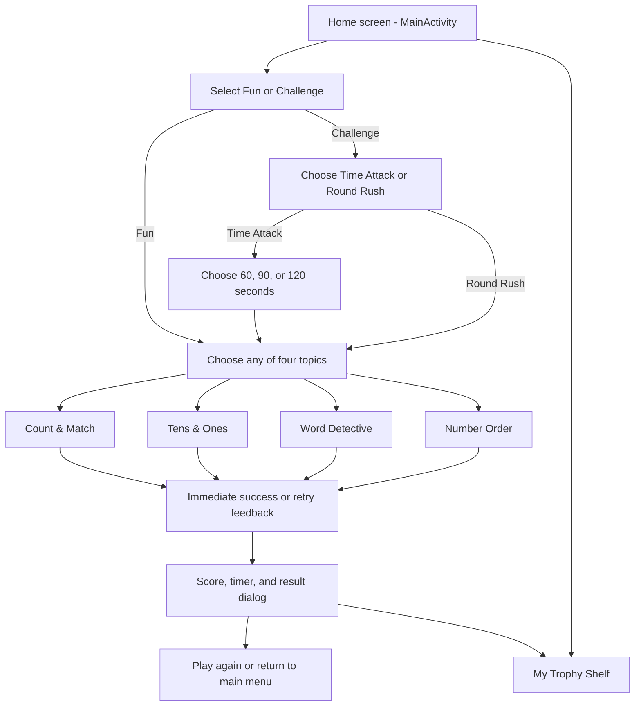

**Diagram 1. Number Quest navigation and game flow.** The diagram shows direct topic navigation, optional challenge selection, shared feedback, results, and trophy history.

### Screenshots captured for the report

| Figure | Captured screen | Caption | Simple explanation to place below the figure |
|---|---|---|---|
| Figure 1 | Home screen in Fun mode, including all four topic cards | **Figure 1. Number Quest home screen in Fun mode.** | The home screen lets the child choose relaxed or challenge play and open any of the four learning topics directly. |
| Figure 2 | Home screen with Challenge selected | **Figure 2. Challenge mode selected on the home screen.** | Selecting Challenge changes the mode hint and prepares the chosen topic to use a timed challenge. |
| Figure 3 | Challenge selection dialog | **Figure 3. Time Attack and Round Rush challenge choices.** | Time Attack scores correct answers before time ends, while Round Rush asks the child to clear progressively larger rounds. |
| Figure 4 | Time selection dialog | **Figure 4. Time Attack duration choices.** | The child can select a 60-, 90-, or 120-second game before starting a topic. |
| Figure 5 | Count & Match question | **Figure 5. Count & Match number-to-object exercise.** | The child counts the displayed apples, stars, or balloons and chooses the matching number from four options. |
| Figure 6 | Count & Match correct feedback | **Figure 6. Immediate success feedback after a correct count.** | A correct card receives a tick and a success colour, a short message is announced, and the next random question appears automatically. |
| Figure 7 | Tens & Ones question | **Figure 7. Tens & Ones place-value exercise.** | Long blocks represent tens and small square blocks represent ones. The child chooses the two-digit number made by the blocks. |
| Figure 8 | Word-to-number recognition question | **Figure 8. Word Detective word-to-number exercise.** | A number word is displayed and the child chooses the matching numeral. |
| Figure 9 | Number-to-word recognition question | **Figure 9. Word Detective number-to-word exercise.** | A numeral is displayed and the child chooses the matching English words, providing practice in both directions. |
| Figure 10 | Number Order before any placement | **Figure 10. Number Order ascending or descending exercise.** | The child is told to start with the smallest or biggest number and arrange three to six unique balloon numbers. |
| Figure 11 | Number Order after some balloons have been placed | **Figure 11. Drag-and-drop and tap placement in Number Order.** | A number can be dragged into its correct position or tapped to fill the next position, so the task remains usable without dragging. |
| Figure 12 | Challenge result dialog | **Figure 12. Challenge result and high-score feedback.** | When time ends, scoring stops and the result dialog reports the score or round reached, together with the best result. |
| Figure 13 | My Trophy Shelf with Fun records | **Figure 13. Trophy history for Fun mode.** | Completed games are displayed in a RecyclerView with the topic, date, and stars earned. |
| Figure 14 | My Trophy Shelf with Challenge records | **Figure 14. Trophy history for Challenge mode.** | The Challenge tab distinguishes Time Attack and Round Rush records and displays either stars or the round reached. |

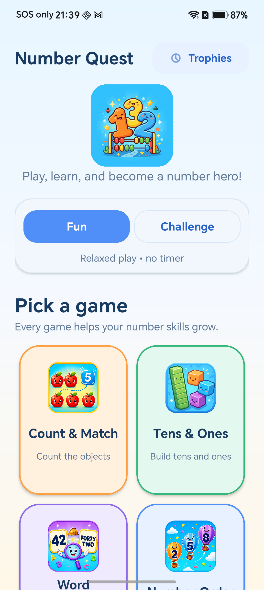

**Figure 1a. Number Quest home screen in Fun mode.** The upper part of the home screen presents the app identity, trophy shortcut, and relaxed Fun mode without a timer.

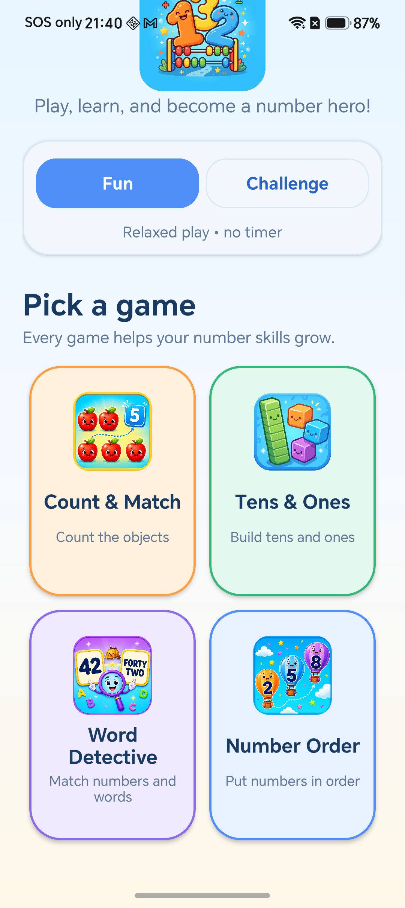

**Figure 1b. Direct access to all four learning topics.** Scrolling slightly reveals Count & Match, Tens & Ones, Word Detective, and Number Order together, so the child can navigate directly to any required topic.

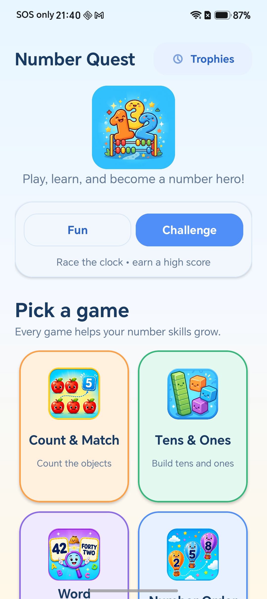

**Figure 2. Challenge mode selected on the home screen.** The checked control and hint clearly show that the next selected topic will use a timed high-score challenge.

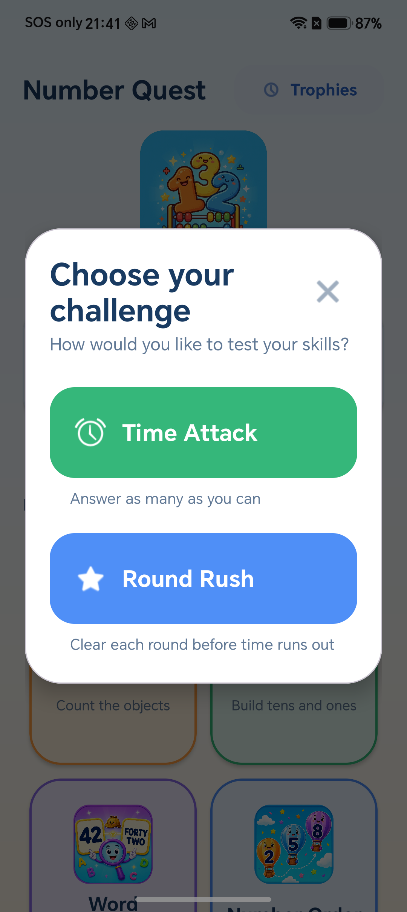

**Figure 3. Time Attack and Round Rush challenge choices.** The dialog explains the purpose of each challenge with large buttons and short child-friendly subtitles.

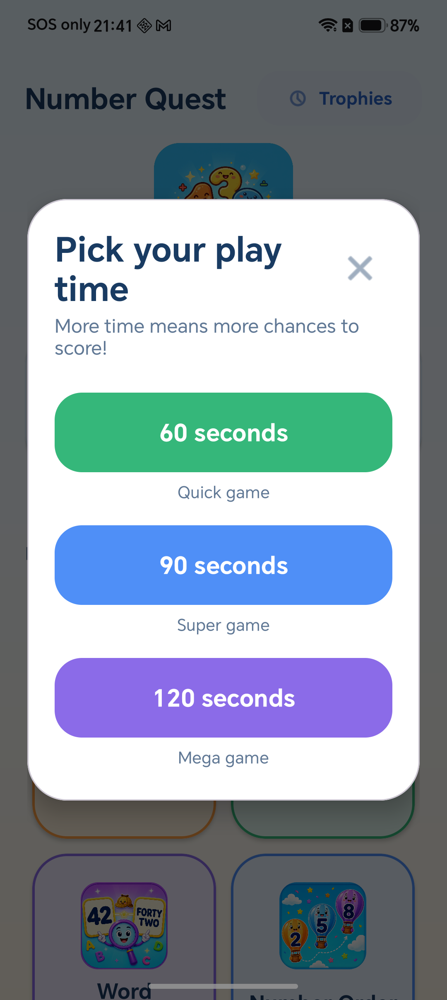

**Figure 4. Time Attack duration choices.** The child can choose a quick 60-second game, a 90-second game, or a longer 120-second game.

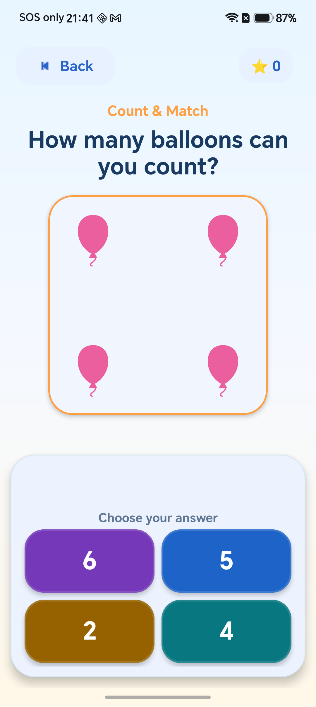

**Figure 5. Count & Match number-to-object exercise.** Four balloons are arranged visibly and the child chooses the matching numeral from four unique answers.

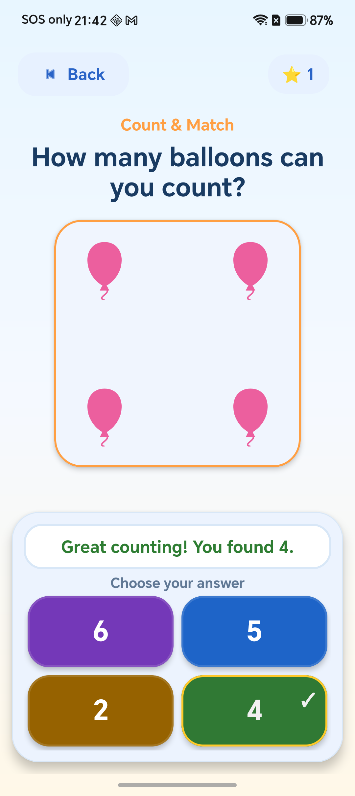

**Figure 6. Immediate success feedback after a correct count.** The score increases once, a tick marks the correct answer, and the message confirms the quantity before the next random exercise.

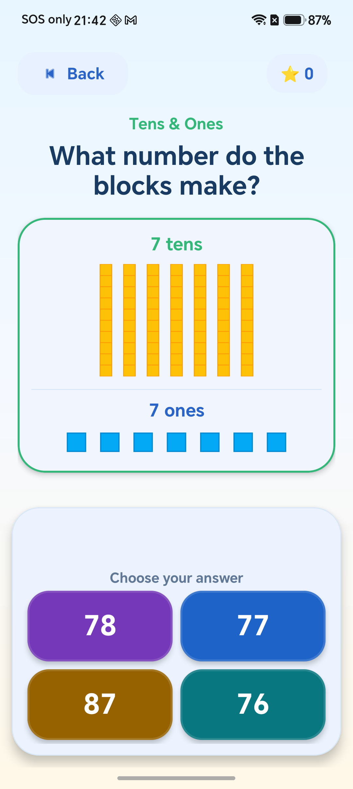

**Figure 7. Tens & Ones place-value exercise.** Seven long ten-blocks and seven one-blocks visually represent 77 without requiring the child to interpret an addition equation.

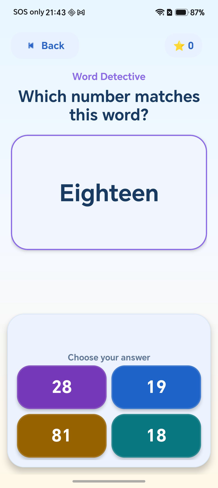

**Figure 8. Word Detective word-to-number exercise.** The English word “Eighteen” is displayed and the child selects the matching numeral.

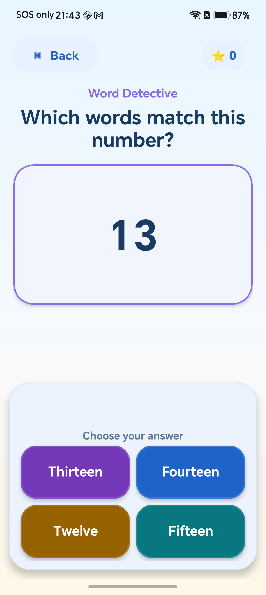

**Figure 9. Word Detective number-to-word exercise.** The numeral 13 is displayed and the child selects “Thirteen,” demonstrating recognition in the reverse direction.

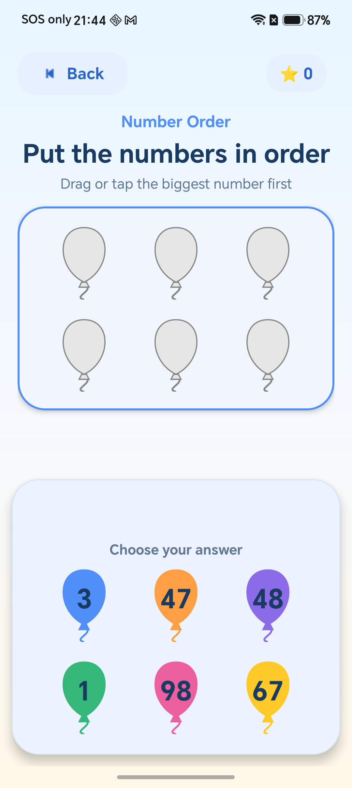

**Figure 10. Number Order descending exercise.** Six unique balloon numbers are presented with the plain instruction to begin with the biggest number.

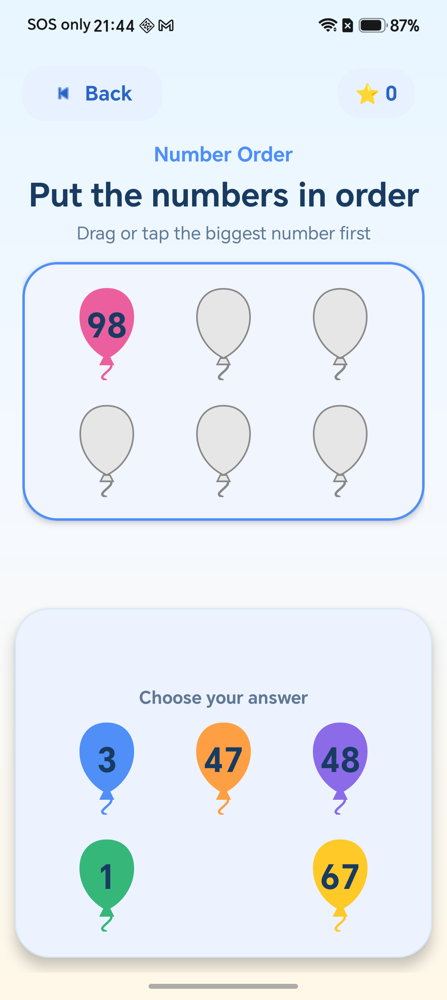

**Figure 11. Tap placement in Number Order.** The largest value, 98, has been placed in the first position and removed from the source choices; the same placement could also be completed by dragging.

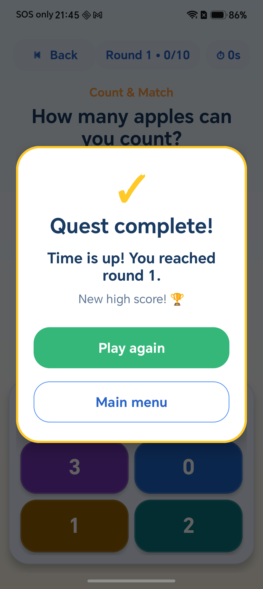

**Figure 12. Challenge result and high-score feedback.** When the Round Rush timer reaches zero, the game locks, reports the round reached, and offers Play Again or Main Menu.

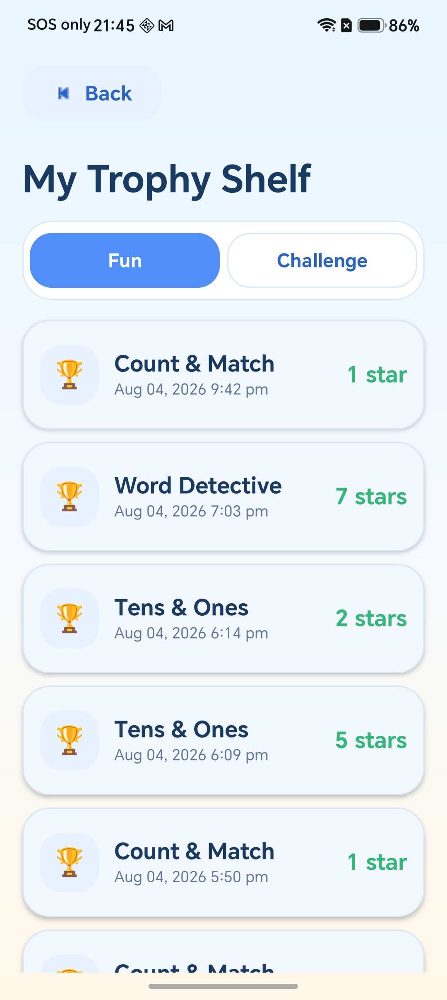

**Figure 13. Trophy history for Fun mode.** The newest relaxed-play result appears first, with each card showing the learning topic, time, and stars earned.

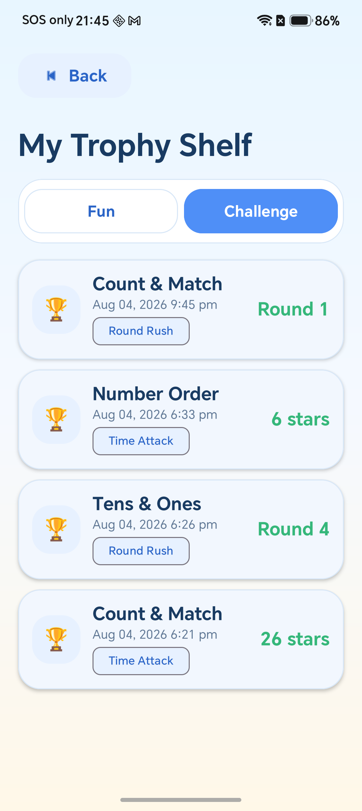

**Figure 14. Trophy history for Challenge mode.** The Challenge tab labels each record as Time Attack or Round Rush and displays either stars or the round reached.

Suggested report references include: “The four required learning games are directly accessible from the home screen, as shown in Figure 1.” “The visual tens and ones representation in Figure 7 avoids requiring prior knowledge of addition symbols.” “Figure 11 shows that the ordering game supports both drag-and-drop and tap interaction.”

## 3. The four required learning topics

### 3.1 Number-to-object association - Count & Match

Count & Match displays between one and nine objects in a balanced 3-by-3 visual arrangement. Each question randomly chooses apples, stars, or balloons and provides four unique numerical answers containing exactly one correct option. The combination of the quantity and picture theme is not immediately repeated.

The child selects an answer card. A correct answer disables all choices so it cannot be counted twice, displays a visible tick, provides haptic and animated feedback, increases the score once, and loads another question. An incorrect answer changes the card to a retry colour, shakes it, and displays the child-friendly message “Almost! Count each picture again.” The response is not communicated by colour alone because text, animation, haptic feedback, and a tick are also used.

Key implementation functions are `generateObjectCount()`, `generateRecognitionOptions()`, `getActiveIndices()`, `renderObjectsUI()`, `renderOptionsUI()`, and `checkAnswer()`.

### 3.2 Place value - Tens & Ones

Tens & Ones generates a random two-digit number from 10 to 99. The number is split into one to nine tens and zero to nine ones. A long segmented block represents a group of ten and each square block represents one. Labels such as “2 tens” and “4 ones” reinforce the meaning without using an unexplained mathematical equation.

The blocks are created dynamically and placed inside Flexbox layouts, allowing them to wrap when the screen is narrow. Four unique answer options are generated, including one correct total. After a correct answer, the feedback also says the number in words, for example, “2 tens and 4 ones make twenty-four.” The same number is not immediately repeated.

Key implementation functions are `generatePlaceValue()`, `renderVisualUI()`, `renderOptionsUI()`, `checkAnswer()`, and `successMessage()`.

### 3.3 Number recognition - Word Detective

Word Detective covers every whole number from 0 to 99 and randomly uses two prompt directions. In a word-to-number question, the app displays an English number word and asks the child to choose its numeral. In a number-to-word question, the app displays the numeral and asks the child to choose the correct English words. This two-way practice is broader than a one-direction matching exercise.

The `numberToWords()` function handles zero, one to nineteen, the multiples of ten, and hyphenated two-digit words such as “Forty-Two.” Distractors are deliberately similar to the correct number: possible options include a reversed digit pair and nearby values differing by ten, two, or one. The options remain unique, remain inside 0 to 99, and contain the answer exactly once. The same target and prompt direction are not immediately repeated together.

Key implementation functions are `generateRecognitionExercise()`, `generateRecognitionOptions()`, `numberToWords()`, `renderQuestion()`, `checkAnswer()`, and `successMessage()`.

### 3.4 Numbers in sequence - Number Order

Number Order generates between three and six unique whole numbers from 0 to 99. Each exercise randomly asks for ascending order, described to the child as “smallest to biggest,” or descending order, described as “biggest to smallest.” The screen intentionally avoids relying on inequality symbols.

The numbers appear on coloured balloon controls. The child may drag each balloon to the correct empty position. The same task can also be completed by tapping the next correct number, which improves accessibility and provides an alternative when dragging is difficult. A wrong choice produces a shake, haptic feedback, and a message explaining whether to find the smallest or biggest remaining number. A complete set is scored only once, and the exact set-plus-direction question is not immediately repeated.

Key implementation functions are `generateSortExercise()`, `orderedNumbers`, `balloonRowPattern()`, `attachDropTarget()`, `attachImmediateDrag()`, `placeByTap()`, `placeNumber()`, and `showSequenceRetry()`.

## 4. Additional features

### 4.1 Fun mode

Fun mode provides untimed practice. A visible star score counts completed exercises, while the child can leave at any time using the Back button. A completed Fun session with at least one correct answer is saved to the trophy history. Rotation does not create an extra record because the app only saves when the Activity is actually finishing.

### 4.2 Time Attack

Time Attack offers 60-, 90-, and 120-second choices. `CountDownTimer` updates the timer once per second. Each completed exercise adds one star. When the timer ends, `isGameOver` is set before the result appears, preventing any delayed tap from adding another score. High scores are stored separately for each topic and duration.

### 4.3 Round Rush

Round Rush starts with 10 questions in 30 seconds. Every completed round adds five questions and ten seconds to the next round. The screen displays the current round and progress. The final history and high-score value is the round reached.

### 4.4 My Trophy Shelf

The My Trophy Shelf screen separates Fun and Challenge records. `HistoryManager` stores the newest record first and limits the list to 100 records so local preferences cannot grow without limit. If the stored JSON is damaged, the app safely returns an empty list rather than crashing. `HistoryAdapter` displays the child-friendly topic title, date, score, and challenge type.

### 4.5 Immediate multimodal feedback

Correct answers use a visible tick, success colour, encouraging text, a short scale animation, and haptic feedback. Retry feedback uses a shake animation, explanatory text, a retry colour, and a different haptic response. This design provides clear feedback without shaming language and without relying only on colour.

## 5. Techniques used and relationship to the course material

The supplied course material teaches Android Activities, Intents, XML layouts, input listeners, ConstraintLayout, RecyclerView, UI feedback, animation, XML drawables, and SharedPreferences. Number Quest applies those concepts and extends several of them as shown below.

| Technique | Use in Number Quest | Relationship to supplied course material |
|---|---|---|
| Activities and lifecycle callbacks | Separate Activities are used for the home screen, four topics, and history. | Directly follows the Android Activity material. |
| Explicit Intents and extras | The home screen opens a selected topic and passes `GAME_MODE` and `TIME_LIMIT`. | Directly follows the navigation and data-passing material. |
| XML layouts plus dynamic UI | Static screen structure is defined in XML; objects, blocks, choices, and balloons are generated in Java. | Extends the course example of combining XML with dynamic code. |
| Click listeners | Cards, buttons, answers, mode controls, and tap-to-place balloons use listeners. | Directly follows the input-event practical. |
| ConstraintLayout and scrollable content | Game screens constrain a scrollable question area above a fixed answer tray. | Uses the modern layout introduced in the UI lecture. |
| RecyclerView with Adapter/ViewHolder | Trophy records are displayed efficiently as reusable history cards. | Implements the more up-to-date RecyclerView homework from Practical 2. |
| SharedPreferences | High scores and history are kept locally. | Uses the storage method taught in Practical 6. |
| XML and property animation | Wrong answers shake; correct answers scale and fade into view. | Applies the animation concepts taught in the animation lecture. |
| XML vector and shape drawables | Balloons, stars, blocks, backgrounds, status labels, and feedback panels use XML resources. | Extends the XML shape-drawable material from the low-level UI practical. |
| Haptic and visual feedback | Correct and retry actions use different haptic responses and animations. | Applies the UI-design lecture's recommendation for visible and haptic feedback. |
| Java 17 with Kotlin DSL | Application and test logic is written in Java 17, while Gradle build configuration remains in Kotlin DSL. | Directly follows Practical 1, which selects Java for programming and Kotlin DSL for build configuration. |
| Material 3 design system | MaterialCardView, MaterialButton, Chip, ShapeableImageView, rounded surfaces, and state selectors create a consistent visual system. | A modern extension beyond the basic widgets used in the practical examples. |
| Runtime drag-and-drop | Balloon views use `startDragAndDrop`, `ClipData`, drag events, and drop targets. | The supplied slides discuss input and UI design, but this runtime drag implementation is an additional technique. |
| Tap alternative to dragging | The next correct number can be tapped instead of dragged. | An added accessibility and usability technique. |
| FlexboxLayout | Tens and ones blocks wrap responsively. | Uses an external layout library not demonstrated in the supplied exercises. |
| Reusable base game framework | `BaseGameActivity` centralises score, timer, results, feedback, lifecycle state, and history. | An object-oriented reuse technique beyond making each exercise screen independent. |
| Gson JSON history | A list of `HistoryRecord` objects is serialized into SharedPreferences, bounded to 100 entries, and parsed safely. | Extends the course's basic string/integer preference examples. |
| Lifecycle-safe state restoration | Question data, choices, placed balloons, score, timer, result state, and history-save state are stored in `Bundle`. | Extends the basic `onCreate(Bundle)` examples into complete recreation support. |
| Accessibility APIs | Content descriptions, polite live regions, focusable controls, large targets, tap alternatives, and non-colour feedback are used. | Applies and extends the general accessibility principles in the UI-design lecture. |
| Unit-tested generators | JUnit tests repeatedly verify ranges, unique choices, exact answers, ordering, boundaries, and invalid requests. | An additional correctness technique not developed in the supplied practical tasks. |
| Resource qualifiers | Landscape-specific dimensions reduce margins and control sizes while preserving the same layouts. | An additional responsive-layout technique. |

The app intentionally does not use SQLite, networking, web services, Supabase, accounts, advertising, analytics, or unnecessary permissions. SharedPreferences is sufficient for the small local score and trophy records.

## 6. Program design and correctness

### 6.1 Reusable architecture

`MainActivity` handles navigation and mode selection. Each topic Activity handles only its own learning content. `BaseGameActivity` supplies shared answer rendering, scoring, timers, feedback, result dialogs, high scores, history saving, and lifecycle state. `ExerciseGeneratorUtil` keeps random generation outside the UI so it can be tested independently. History storage and display are separated into `HistoryManager`, `HistoryRecord`, `HistoryAdapter`, and `HistoryActivity`.

### 6.2 Exercise validation

The random generators use `require()` checks to reject invalid bounds. Multiple-choice lists use linked sets to guarantee uniqueness and include the target before distractors are added. Sort exercises use a set and validate that the requested number of unique values fits the allowed range. All current learning exercises remain within 0 to 99, and the counting exercise remains within 1 to 9.

### 6.3 Protection from duplicate scoring

Every topic checks `questionLocked` and `isGameOver` before accepting an answer. When the correct answer is selected, the question is locked and the answer controls are disabled before the animation and delayed next-question callback occur. This ensures that rapid repeated taps cannot count the same answer twice.

### 6.4 Lifecycle recreation

The game Activities save their current target, options, prompt type or direction, placed values, repeat-prevention signature, and question lock. `BaseGameActivity` separately saves the score, round, round progress, remaining time, game-over state, pending result text, and whether history was already saved. Therefore, a rotation restores the same exercise and progress instead of generating a different question, resetting the timer, or duplicating history.

### 6.5 Local history safety

History data is restricted to 100 entries. JSON parsing uses `runCatching`, so malformed stored data becomes an empty history rather than an application crash. Challenge completion sets the game-over flag and cancels the timer before saving or displaying the result.

## 7. User friendliness, responsive layout, and accessibility

- Large answer cards are normally 72dp high, and major navigation controls are 52dp or more.
- NestedScrollView is used on the home and question areas to support smaller screens and larger font settings.
- Landscape dimension resources reduce spacing and balloon sizes so the content remains usable after rotation.
- The light gradient, dark navy text, and saturated answer colours provide a clear visual hierarchy and strong contrast.
- Rounded Material cards and consistent orange, green, purple, and blue topic colours create a playful game identity.
- All user-facing interface text is stored in `strings.xml` or plural resources rather than being hardcoded in layouts or Activities.
- Plural resources produce correct phrases such as “1 star” and “2 stars,” “1 ten” and “2 tens,” and “1 second” and “2 seconds.”
- Decorative images are hidden from accessibility services, while meaningful objects, answer cards, positions, and actions have content descriptions.
- Feedback TextViews use a polite accessibility live region so screen readers can announce results without an intrusive interruption.
- Number Order supports both dragging and tapping, and `BalloonFrameLayout.performClick()` preserves proper click semantics for accessibility tools.
- Correctness is communicated by text, a tick, animation, haptic response, and colour; retry guidance similarly combines several signals.

## 8. Testing and verification evidence

The JUnit test class checks the following generator behaviour:

- recognition choices contain four unique values and exactly one correct answer;
- both word-to-number and number-to-word prompt modes support the 0 and 99 boundaries;
- generated sort lists contain the requested number of unique values;
- ascending and descending exercises work for lengths from three to six;
- sequence exercises can include 0 and 99;
- balloon row patterns are correct for three, four, five, and six items;
- unsupported balloon counts and impossible unique-value requests are rejected; and
- English number words are correct for representative boundaries and two-digit values.

The Android instrumented test verifies the application package name. Physical-device QA covers home navigation, all four topic screens, correct and retry feedback, rapid-tap scoring protection, tap and drag placement, rotation, landscape layout, larger font settings, challenge mode selection, result dialogs, and trophy history.

Verification was repeated after the Java 17 conversion on 4 August 2026 using the required final command:

> The Java-only application was verified with `gradlew.bat testDebugUnitTest lintDebug assembleDebug --no-daemon`. Unit tests passed, Android lint reported no errors, no Kotlin source compilation task ran, and the debug APK was generated successfully.

---

# Appendix A - Java source-code listing order

The report guideline asks for the relevant source code in an appendix. Include the complete Java files in the following order. Use a monospaced font, preserve indentation, add a filename heading before each listing, and allow code to wrap or continue across pages without shrinking it to an unreadable size.

1. `MainActivity.java` - home navigation and mode dialogs.
2. `BaseGameActivity.java` - common game modes, choices, feedback, timer, scoring, results, lifecycle, and history integration.
3. `AnswerChoice.java` - immutable answer-card data model.
4. `ExerciseGeneratorUtil.java` - all reusable random generators, option validation, ordering, and number-to-word conversion.
5. `AssociationActivity.java` - Count & Match topic.
6. `PlaceValueActivity.java` - Tens & Ones topic.
7. `RecognitionActivity.java` - Word Detective topic.
8. `SequenceActivity.java` - Number Order topic.
9. `BalloonFrameLayout.java` - accessible custom balloon container.
10. `HistoryRecord.java` - history data model.
11. `HistoryManager.java` - bounded, safe local history persistence.
12. `HistoryAdapter.java` - RecyclerView binding for trophy cards.
13. `HistoryActivity.java` - Fun and Challenge history screen.
14. `ExerciseGeneratorUtilTest.java` - meaningful generator unit tests.
15. `ExampleInstrumentedTest.java` - package verification on an Android target.

The most report-relevant XML can be included after the Java listings if space permits: `AndroidManifest.xml`, the six `activity_*.xml` layouts, the three dialog layouts, `strings.xml`, `colors.xml`, `dimens.xml`, the landscape `dimens.xml`, and `themes.xml`.

---

# Appendix B - Complete function catalogue

## `MainActivity.java`

| Function | Purpose |
|---|---|
| `onCreate()` | Loads the home layout, connects mode/history/topic controls, obtains the selected mode, and opens the selected topic. |
| `selectMode()` | Updates the checked Fun/Challenge button and its explanatory hint. |
| `getSelectedMode()` | Returns the internal `FUN` or `CHALLENGE` selection. |
| `handleGameSelection()` | Starts a Fun game immediately or opens the challenge dialog. |
| `showChallengeSelectionDialog()` | Offers Time Attack or Round Rush and passes the chosen game mode. |
| `showTimeSelectionDialog()` | Offers 60, 90, or 120 seconds and passes the selected duration. |
| `startTimeAttack()` | Closes the dialog and starts the selected topic with the requested duration. |
| `showFullScreenDialog()` | Applies the shared transparent full-screen window styling to mode dialogs. |

## `BaseGameActivity.java`

| Function | Purpose |
|---|---|
| `onCreate()` | Reads Intent extras and restores shared game state from the saved Bundle. |
| `setupGameModeUI()` | Connects score/timer views and starts or restores Fun, Time Attack, or Round Rush behaviour. |
| `startScoreAttackRound()` | Calculates the current Round Rush target and duration, updates progress, and starts the timer. |
| `updateScoreAttackUI()` | Displays the round and current question progress. |
| `onQuestionCompleted()` | Adds one score, advances Round Rush progress, and starts the next round when its target is met. |
| `renderAnswerChoices()` | Inflates reusable answer cards, assigns accessible labels and colours, and creates a responsive grid. |
| `completeAnswerChoice()` | Disables all answer cards, marks the correct card, and begins success feedback. |
| `retryAnswerChoice()` | Temporarily applies the retry colour and starts retry feedback. |
| `restoreCompletedAnswerChoice()` | Recreates the disabled and marked correct choice after Activity recreation. |
| `restoreCompletedQuestion()` | Restores visible success feedback and schedules the next question safely. |
| `celebrateQuestion()` | Shows success text, animation, haptic feedback, scoring, and delayed progression. |
| `showRetryFeedback()` | Shows child-friendly retry text, haptic feedback, and the shake animation. |
| `resetFeedback()` | Clears the previous feedback state before a new question. |
| `updateScoreText()` | Formats and displays the current star score. |
| `updateTimerText()` | Formats and displays remaining seconds. |
| `startGameTimer()` | Runs a one-second `CountDownTimer`, updates remaining time, and ends the game at zero. |
| `onTick()` | Saves and displays the newest remaining time. |
| `onFinish()` | Shows zero and triggers game completion. |
| `getHighScoreKey()` | Creates a topic-, mode-, and duration-specific high-score key. |
| `endGame()` | Locks the game, saves history/high score, prepares result text, and opens the result dialog. |
| `showResultDialog()` | Displays the final result and provides Play Again and Main Menu actions. |
| `saveHistoryRecord()` | Adds one guarded history record for the current session. |
| `onDestroy()` | Cancels timers and saves a completed Fun session only when the Activity is finishing. |
| `onSaveInstanceState()` | Stores all shared score, timer, round, result, and history-save state. |

## `AssociationActivity.java`

| Function | Purpose |
|---|---|
| `onCreate()` | Loads Count & Match and restores or generates its first question. |
| `initializeUI()` | Connects the object grid, answer grid, instructions, feedback, and Back button. |
| `loadNextQuestion()` | Chooses a random quantity/theme pair, avoids an immediate identical pair, and creates four options. |
| `restoreQuestion()` | Restores the quantity, theme, choices, repeat-prevention state, and locked answer. |
| `renderQuestion()` | Updates the theme prompt, objects, and answer choices. |
| `renderObjectsUI()` | Creates nine grid positions and displays the active object images with accessibility descriptions. |
| `getActiveIndices()` | Returns balanced 3-by-3 positions for each visible quantity from one to nine. |
| `renderOptionsUI()` | Converts numeric options into shared accessible answer cards. |
| `checkAnswer()` | Rejects late or repeated input and routes the selection to success or retry feedback. |
| `onSaveInstanceState()` | Saves the current Count & Match exercise and lock state. |

## `PlaceValueActivity.java`

| Function | Purpose |
|---|---|
| `onCreate()` | Loads Tens & Ones and restores or generates its first question. |
| `initializeUI()` | Connects block containers, labels, choices, feedback, and navigation. |
| `loadNextQuestion()` | Generates a non-repeated two-digit place-value exercise and four options. |
| `restoreQuestion()` | Restores tens, ones, options, repeat prevention, and completion state. |
| `renderQuestion()` | Renders the blocks and answer options. |
| `renderVisualUI()` | Creates labelled ten-bars and one-squares inside wrapping Flexbox layouts. |
| `renderOptionsUI()` | Builds shared numeric answer cards. |
| `checkAnswer()` | Compares the selected total with the number represented by the blocks. |
| `successMessage()` | Explains the correct number using tens, ones, and English number words. |
| `onSaveInstanceState()` | Saves the place-value question and lock state. |

## `RecognitionActivity.java`

| Function | Purpose |
|---|---|
| `onCreate()` | Loads Word Detective and restores or generates its first question. |
| `initializeUI()` | Connects the prompt, target, answers, feedback, and navigation. |
| `loadNextQuestion()` | Generates a two-way recognition exercise and prevents the same target/mode pair from repeating immediately. |
| `restoreQuestion()` | Restores the target, direction, options, repeat-prevention data, and completion state. |
| `renderQuestion()` | Switches between word-to-number and number-to-word prompts and builds suitable answer labels. |
| `checkAnswer()` | Validates the selected numeral or word choice and gives direction-specific retry guidance. |
| `successMessage()` | States the correct English word and numeral together. |
| `onSaveInstanceState()` | Saves the current recognition exercise and lock state. |

## `SequenceActivity.java`

| Function | Purpose |
|---|---|
| `onCreate()` | Loads Number Order and restores or generates its first exercise. |
| `initializeUI()` | Connects target balloons, option balloons, direction text, feedback, and navigation. |
| `loadNextQuestion()` | Generates three to six unique values and avoids immediately repeating the same values and direction. |
| `restoreQuestion()` | Validates and restores options, direction, placed values, repeat signature, and lock state. |
| `questionSignature()` | Creates the repeat-prevention signature from direction and sorted values. |
| `renderQuestion()` | Displays child-friendly direction text and renders targets and choices. |
| `renderSequenceTargets()` | Creates empty or filled balloon positions and attaches drop targets where needed. |
| `renderAnswerBalloons()` | Creates coloured source balloons with content descriptions, tap handling, and drag handling. |
| `renderBalloonRows()` | Applies a balanced row pattern for three to six balloons. |
| `inflateBalloon()` | Inflates and sizes one reusable custom balloon view. |
| `attachDropTarget()` | Accepts valid text drag data, validates the number and destination, and handles drag feedback. |
| `parseDraggedNumber()` | Safely converts text drag data into a number or rejects malformed data. |
| `attachImmediateDrag()` | Detects movement beyond touch slop and starts a native drag with `ClipData`. |
| `placeByTap()` | Places a tapped number in the next position when it is correct. |
| `placeNumber()` | Records a valid placement, hides its source, fills its target, and completes the question once. |
| `successMessage()` | Returns the correct ascending or descending completion message. |
| `fillTargetView()` | Displays a placed number, applies its colour, and updates its position description. |
| `showSequenceRetry()` | Explains whether the next required number is the smallest or biggest. |
| `colorForNumber()` | Assigns a stable colour based on the option's position. |
| `onSaveInstanceState()` | Saves options, direction, placed values, signature, and lock state. |

## `ExerciseGeneratorUtil.java`

| Function or property | Purpose |
|---|---|
| `PlaceValueData.getTotal()` | Converts tens and ones into the represented two-digit number. |
| `SortExercise.getOrderedNumbers()` | Returns ascending or descending correct order. |
| `SequenceData.getMissingValue()` | Returns the selected missing sequence value for the supporting sequence generator. |
| `SequenceData.equals()` / `hashCode()` | Compares `IntArray` content correctly in tests or collections. |
| `generateObjectCount()` | Validates the upper bound and returns a counting quantity from one to that bound. |
| `generatePlaceValue()` | Validates the tens bound and returns random tens and ones. |
| `generateRecognitionOptions()` | Creates unique bounded distractors containing exactly one target. |
| `generateRecognitionExercise()` | Creates a target, four choices, and a random recognition direction. |
| `generateSequence()` | Creates an arithmetic sequence and selects a missing position; this is a supporting utility and is not used by the current ordering screen. |
| `numberToWords()` | Converts 0 to 99 into English words. |
| `generateSortSequence()` | Creates a requested count of unique values; retained as a tested supporting generator. |
| `generateSortExercise()` | Validates bounds and returns unique shuffled values with a sort direction. |
| `balloonRowPattern()` | Returns balanced row sizes for three to six balloons. |

## History and custom-view files

| File and function | Purpose |
|---|---|
| `BalloonFrameLayout.performClick()` | Preserves proper click behaviour for a custom view that also handles touch gestures. |
| `HistoryActivity.onCreate()` | Loads history, RecyclerView, mode controls, and restored tab selection. |
| `HistoryActivity.selectMode()` | Updates the checked Fun/Challenge control and refreshes the list. |
| `HistoryActivity.updateList()` | Filters records and shows either the RecyclerView or empty-state message. |
| `HistoryActivity.onSaveInstanceState()` | Preserves the selected history mode after recreation. |
| `HistoryAdapter.onCreateViewHolder()` | Inflates one trophy-history card. |
| `HistoryAdapter.onBindViewHolder()` | Binds child-friendly topic/mode text, score or round, and formatted date. |
| `HistoryAdapter.getItemCount()` | Reports the number of visible history records. |
| `HistoryManager.saveRecord()` | Inserts the newest record, limits history to 100, serializes JSON, and saves it. |
| `HistoryManager.getHistory()` | Reads and safely parses JSON or returns an empty list. |
| `HistoryRecord` | Stores the game name, mode, score/round, and timestamp. |

---

# Appendix C - Project file analysis

## Java implementation files

| File | Role |
|---|---|
| `MainActivity.java` | Home screen, mode state, direct topic navigation, and challenge dialogs. |
| `BaseGameActivity.java` | Shared game framework for score, timer, Round Rush, answer cards, feedback, results, high scores, history, and lifecycle. |
| `AnswerChoice.java` | Immutable value, label, and accessibility description for an answer card. |
| `AssociationActivity.java` | Number-to-object association topic. |
| `PlaceValueActivity.java` | Visual tens-and-ones topic. |
| `RecognitionActivity.java` | Two-way numeral and English-word recognition topic. |
| `SequenceActivity.java` | Ascending/descending ordering with drag and tap. |
| `ExerciseGeneratorUtil.java` | Validated random exercise logic and number words. |
| `BalloonFrameLayout.java` | Custom accessible click wrapper for balloon controls. |
| `HistoryActivity.java` | Trophy screen and mode filtering. |
| `HistoryAdapter.java` | RecyclerView Adapter/ViewHolder binding. |
| `HistoryManager.java` | SharedPreferences/Gson persistence. |
| `HistoryRecord.java` | Immutable trophy record model with Java getters and value equality. |

## Layout files

| File | Role |
|---|---|
| `activity_main.xml` | Scrollable home screen, logo, mode selector, history button, and four direct topic cards. |
| `activity_association.xml` | Count & Match header, scrollable object area, feedback, and fixed answer tray. |
| `activity_place_value.xml` | Tens-and-ones visual containers, labels, and answer tray. |
| `activity_recognition.xml` | Prompt, large target card, and word/number answers. |
| `activity_sequence.xml` | Direction prompt, target balloons, source balloons, and answer tray. |
| `activity_history.xml` | Trophy title, Fun/Challenge selector, RecyclerView, and empty state. |
| `dialog_challenge_selection.xml` | Full-screen-styled Time Attack/Round Rush selection card. |
| `dialog_time_selection.xml` | 60-, 90-, and 120-second choices. |
| `dialog_game_result.xml` | Non-cancellable result, record, replay, and menu actions. |
| `item_answer_choicer.xml` | Reusable, large, focusable Material answer card with a visible correct tick. |
| `item_balloon.xml` | Reusable focusable balloon with number label. |
| `item_history.xml` | Reusable trophy history card. |

## Value, style, selector, animation, and drawable resources

| File or group | Role |
|---|---|
| `strings.xml` | All child-facing text, format strings, accessible descriptions, and plural rules. |
| `colors.xml` | Consistent high-contrast game palette and feedback colours. |
| `dimens.xml` | Shared margins, answer sizes, and balloon sizes. |
| `values-land/dimens.xml` | Smaller landscape geometry for responsive screens. |
| `themes.xml` | Material 3 light theme, rounded font, status/navigation colours, Back-button style, icon shape, and full-screen dialog style. |
| `values-night/themes.xml` | Keeps the intentionally light child-friendly appearance when system night mode is active. |
| `mode_toggle_*.xml` | State-list colours for checked, pressed, hovered, focused, and default mode buttons. |
| `shake.xml` | Repeating horizontal retry animation. |
| `bg_game_gradient.xml` | Light blue-to-cream game background. |
| `bg_feedback.xml` | Rounded feedback panel with border and padding. |
| `bg_status_blue.xml` | Rounded score/timer status background. |
| `ic_balloon.xml` | Tintable balloon vector used for counting and ordering. |
| `ic_count_star.xml` | Star counting vector. |
| `ic_tens_block.xml` / `ic_ones_block.xml` | Visual base-ten teaching blocks. |
| `bg_prompt_panel.xml` | Alternate prompt-panel drawable retained in resources but not referenced by the current layouts. |

## Raster artwork

| File | Current use |
|---|---|
| `logo.png` | Home logo and launcher foreground/monochrome source. |
| `game_apple.jpg` | Apple image in Count & Match. |
| `icon_count_children.png` | Count & Match home card. |
| `icon_place_value.png` | Tens & Ones home card. |
| `icon_word_detective_children.png` | Word Detective home card. |
| `icon_sequence_children.png` | Number Order home card. |
| `icon_association.png`, `icon_recognition.png`, `icon_sequence.png` | Alternate topic artwork retained in the source tree but not referenced by the current home layout. |

## Configuration and build files

| File | Role |
|---|---|
| `AndroidManifest.xml` | Declares the launcher and five non-exported internal Activities; declares no unnecessary permissions. |
| `app/build.gradle.kts` | Application ID, API levels, Java 17 target, build type, and app dependencies. |
| `gradle/libs.versions.toml` | Central version catalogue for AGP, AndroidX, Material, Flexbox, Gson, and tests. |
| `gradle-wrapper.properties` | Pins Gradle 9.1.0 and its SHA-256 checksum. |
| `settings.gradle.kts` | Repository policy, root project name, and `app` module. |
| Root `build.gradle.kts` | Declares the Android application plugin alias. |
| `gradle.properties` | Project-wide Gradle JVM memory settings. |
| `proguard-rules.pro` | Default project ProGuard template; release minification is currently disabled. |
| `backup_rules.xml` / `data_extraction_rules.xml` | Android backup/data-transfer rule templates. |
| `gradlew`, `gradlew.bat`, `gradle-wrapper.jar` | Standard Gradle Wrapper launchers and bootstrap JAR. |
| `.gitignore`, `app/.gitignore` | Exclude generated build files, IDE state, local SDK configuration, packages, credentials, logs, and QA intermediates. |

## Test files

| File | Role |
|---|---|
| `ExerciseGeneratorUtilTest.java` | Nine meaningful JUnit tests for uniqueness, ranges, boundaries, modes, ordering, invalid requests, row layouts, and number words. |
| `ExampleInstrumentedTest.java` | Confirms the installed app uses the required package name. |

## Documentation and non-source artifacts

- `Individual_Practical_Assignment_Guideline.docx` is the authoritative assignment specification and contains the required cover page, topics, marking scheme, submission format, and deadline.
- `Individual_Practical_Report_Guideline.pdf` is the authoritative one-page report guide. It requires a brief app account, labelled and referenced screenshots/diagrams with simple explanations, discussion of techniques different from the course, and relevant source code in an appendix.
- The seven lecture PDFs and fourteen practical/reference PDFs were reviewed to classify the techniques in Section 5.
- Files under `.idea/`, `.gradle/`, `.kotlin/`, `app/build/`, root inspection XML exports, build reports, `local.properties`, and `tmp/` are machine-local, generated, diagnostic, or QA artifacts. They should not be described as app source code or included in the submission ZIP.

---

# Final report assembly checklist

- [ ] Use the official assignment cover page.
- [ ] Keep the app account brief and do not add an unnecessary “why this app was developed” introduction.
- [x] Current physical-device screenshots for Figures 1 to 14 are embedded in the Markdown.
- [ ] Keep every figure number, caption, and in-text reference consistent.
- [ ] Ensure both Word Detective directions are shown or clearly explained.
- [ ] Show both ascending and descending Number Order behaviour in screenshots or text.
- [ ] Show at least one random second exercise to demonstrate that questions change.
- [ ] Highlight Fun mode, Time Attack, Round Rush, feedback, high scores, and trophy history as added features.
- [ ] Explain Java 17, Kotlin DSL, Material 3, runtime drag-and-drop, Flexbox, JSON history, lifecycle restoration, accessibility, and tests as noteworthy techniques.
- [ ] Include the relevant Java source code in the appendix.
- [x] Final unit-test, lint, and debug-assembly verification passed on 4 August 2026.
- [ ] Export the final report to PDF.
- [ ] Package the PDF and source tree without generated or ignored files in `P1-Chai_Boon_Hong-2206806.zip`.
